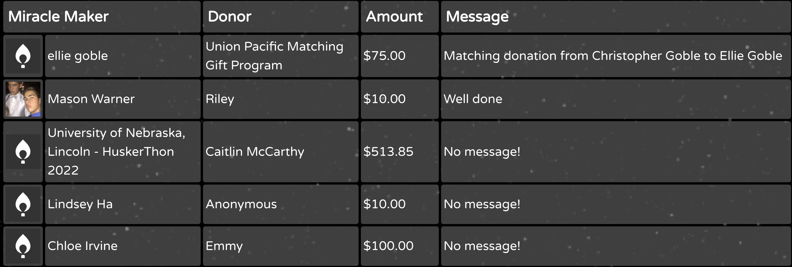
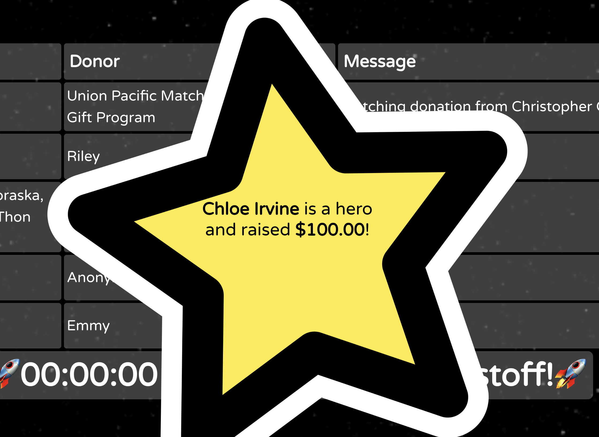
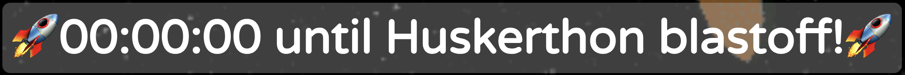

# 💃 Dance Marathon Live Donation Dashboard 🕺
This repository contains a template dashboard for tracking live donations during a Dance Marathon event. Data is pulled directly from DonorDrive.

Below, find general directions for customizing the dashboard for your Dance Marathon event, as well as instructions for running the dashboard locally or hosted on GitHub pages.

To view a paused example, check out [huntergodina.github.io](huntergodina.github.io/undm-dashboard).

⚠️ _Note: some of the styling for the donation table is manually sized and configured to fit on common event displays, such as large TVs, projectors, or compute monitors. The CSS and styling will require significant tuning for mobile devices or non-traditional aspect ratios._

## ✅ Getting Started
Welcome to the Dance Marathon live donation dashboard. This started as a passion project, written as a spur of the moment solution for driving interaction with donations at the University of Nebraska-Lincoln Huskerthon event in 2022. I published this repository in an effort to let other Dance Marathon events use our approach.

---

## 💻 Running The App

This dashboard is configured to use the `gh-pages` React [plugin](https://github.com/gitname/react-gh-pages), which allows publishing directly to the `{username}.github.io` free, provisioned GitHub page for the user that forks this repository.

#### Necessary tools
- Ensure you've installed [npm and Node](https://nodejs.org/en/download/) to be able to utilize plugins and dependencies of this project
- Ensure you've configured [Git](https://git-scm.com/book/en/v2/Getting-Started-Installing-Git) locally, and connected to a remote GitHub account (please fork this repo into your own version, I will not merge any PRs for specific events)

#### Clone the repository
In your terminal of choice, run
```
git clone git@github.com:{your-username}/{your-repository-name}.git
```
to clone your forked version of the code onto your local machine.

Once cloned, switch into the repository folder with
```
cd {your-repository-name}
```

#### Modify the homepage path
In the `package.json` file, modify the `homepage` property, and replace my `huntergodina` username with your own (as well as your own preferred URL path).

#### Deploy your changes
Run `npm run deploy` in your terminal. This script will build your current code, and deploy it to GitHub for display on your site.

You will be able to view your changes at the URL provided in the `package.json` file under `homepage`.

#### Local development
If you don't want to wait for repeated builds and deploys while testing your code, you can run the website locally. Run `npm run start` in your terminal to start a development version of the application on your machine. You can then access it at [http://localhost:3000](http://localhost:3000) in your browser of choice. It will live update with any changes you make as you save the pertinent files.

---
## 🛎 Modifying Core Components

#### Update your DonorDrive event ID
Modify [this line](https://github.com/huntergodina/undm-dashboard/blob/c55245b1622097c554b82ef55e96bdb33b8324cd/src/Dashboard.js#L32) to use your group's event ID in the DonorDrive URL. Example:
```
https://events.dancemarathon.com/api/events/4589/donations?limit=5
```
can become
```
https://events.dancemarathon.com/api/events/1234/donations?limit=5
```
if your event ID is `1234`.

#### Unpause polling of donations
To avoid hammering the APIs for DonorDrive, I paused the auto-refresh of data for this dashboard - known as polling. The site is designed to fetch data every few seconds to keep the dashboard up to date. To re-enable this function, uncomment [this line](https://github.com/huntergodina/undm-dashboard/blob/c55245b1622097c554b82ef55e96bdb33b8324cd/src/Dashboard.js#L22). This will start the polling on whatever interval is defined [here](https://github.com/huntergodina/undm-dashboard/blob/c55245b1622097c554b82ef55e96bdb33b8324cd/src/Dashboard.js#L13) in milliseconds.


### 💸 Donation Table


This simple table shows the five most recent donations, including the name and avatar set by the DonorDrive user, the amount donated, and the message attached to the donation. This data is pulled directly from DonorDrive with some small exceptions.

#### Number of donations
The logic for this is [here](https://github.com/huntergodina/undm-dashboard/blob/c55245b1622097c554b82ef55e96bdb33b8324cd/src/Dashboard.js#L32) in the query parameters for the donations. Simply change  
```
?limit=5
```
to any other number, within DonorDrive's limits, to expand this.

#### Profanity restrictions
In the event that you are concerned about certain words appearing in donation messages, I have added very rudimentary filtering for manually checked words. Simply add undesirable words to [this list](https://github.com/huntergodina/undm-dashboard/blob/c55245b1622097c554b82ef55e96bdb33b8324cd/src/DonationRow.js#L1) and any messages containing them will be replaced with a warning.

### 🚨 Big Donation Alert

This alert was added during our event to highlight any significant donations as they come in. As such, the logic is a bit rudimentary. Currently, the most recent donation, when polled and over a "big donation threshold", will appear as a brief pop-up.

#### Threshold Amount
The threshold for the alerts for donations is set [here](https://github.com/huntergodina/undm-dashboard/blob/c55245b1622097c554b82ef55e96bdb33b8324cd/src/Dashboard.js#L37) when data is fetched after the polling interval. Change the current threshold value to the minimum you'd like to require to display this alert.

#### Display Message
The alert is configured currently to display `*Person* is a hero and raised $X!`. To change this, update the [display lambda](https://github.com/huntergodina/undm-dashboard/blob/c55245b1622097c554b82ef55e96bdb33b8324cd/src/Dashboard.js#L57) with your own message using the name and amount from DonorDrive.

#### Alert Background
Our Huskerthon 2022 event was space themed, hence the star. If you wish to update the image, replace the file [reference](https://github.com/huntergodina/undm-dashboard/blob/c55245b1622097c554b82ef55e96bdb33b8324cd/src/App.css#L109).

### ⏰ Countdown

This general countdown displays below the donations, great for if you're raising money leading up to your main Dance Marathon event. and want to display a countdown to a specific time, day, etc.

#### Target date/time
To change the target countdown date/time, modify the [date/time](https://github.com/huntergodina/undm-dashboard/blob/c55245b1622097c554b82ef55e96bdb33b8324cd/src/Dashboard.js#L65) to show your desired event time.

#### "Until" message
To change the `until Huskerthon blastoff` text, or emojis, modify the [message text](https://github.com/huntergodina/undm-dashboard/blob/c55245b1622097c554b82ef55e96bdb33b8324cd/src/Dashboard.js#L64-L67) in these `span`s.

### 🚀 Background GIF


To add a fun, live sensation to your dashboard, and increase the sensation that it is a living, breathing tracker for your Dance Marathon event, an animated background, or even still image.

#### Change the image
To change the image, simply change the CSS [background attribute](https://github.com/huntergodina/undm-dashboard/blob/c55245b1622097c554b82ef55e96bdb33b8324cd/src/App.css#L21) to your desired gif or image, and it will populate the background.

### 🧪 Experimental/Incomplete Features

This was primarily built in the 12 hours of our 2022 Huskerthon event, during my senior year of college. As such, it has not been expanded upon since I graduated. Some things that I dove into, coding on the fly, didn't get finished because I was also enjoying the event. If you want to finish those things, this is where I would start:

- [ ] Support multiple "big donation" alert messages. Our event wasn't getting large donations fast enough to devote time to supporting multiple names/amounts on our alert. As such, I lazily just used the most recent "big" donation.
- [ ] Re-enable team leaderboards. I don't really remember why I disabled the [Leaderboard](https://github.com/huntergodina/undm-dashboard/blob/master/src/Leaderboard.js) component on the main [dashboard](https://github.com/huntergodina/undm-dashboard/blob/c55245b1622097c554b82ef55e96bdb33b8324cd/src/Dashboard.js#L70-L74), but for some reason I abandoned it. This was a fun way to encourage team competition.